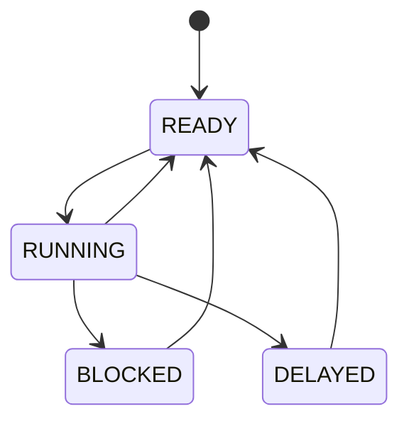

# Morph-RT: Hard Real-Time Operating System Kernel


A hard real-time operating system (RTOS) kernel engineered from scratch for the ARM Cortex-M4 architecture. Written in C11 and Thumb-2 assembly, the system provides deterministic preemption, zero-allocation memory management, and bounded-time IPC primitives.

<div align="center">
  
</div>

## Architecture & Technical Implementation

Morph-RT is designed around a strictly deterministic execution model. Every architectural decision prioritizes bounded worst-case execution time (WCET) over throughput, ensuring absolute predictability for hard real-time constraints.

### Deterministic O(1) Memory Pools

To prevent memory fragmentation and eliminate non-deterministic heap allocation latency, the kernel employs a strictly static, pool-based memory allocator. All kernel objects (TCBs, stacks, IPC primitives) are statically allocated via memory pools during initialization.

Allocations utilize hardware-friendly bitwise logic. Free blocks are tracked via a 64-bit `free_bitmap`. By checking bits, the allocator finds the next free block in strict O(1) time without traversing linked lists.

```text
Memory Pool Layout (e.g., TCB Pool)
+----------------+  <-- pool_start
| TCB Block 0    |  (Allocated: Bit 0 = 0)
+----------------+
| TCB Block 1    |  (Free: Bit 1 = 1)
+----------------+
| ...            |
+----------------+
| TCB Block 63   |
+----------------+  <-- pool_start + (object_size * 64)
```

### Intrusive Linked Lists & State Management

Task states are managed using intrusive linked lists (`list_head_t`). Instead of dynamically allocating queue nodes, each TCB contains embedded links (`ready_link`, `wait_link`, `delay_link`). This guarantees that a task can always be queued without the risk of an out-of-memory failure.



| Transition | Trigger |
|---|---|
| `[*]` → READY | `task_create()` |
| READY → RUNNING | `scheduler_get_next_task()` |
| RUNNING → READY | PendSV preemption |
| RUNNING → BLOCKED | `wait()` on mutex/semaphore/queue |
| BLOCKED → READY | `signal()` or timeout |
| RUNNING → DELAYED | `sleep()` |
| DELAYED → READY | SysTick wakeup |

### Timing Wheel for Bounded Sleep/Wake Cost

An earlier revision kept sleeping tasks on a single delay list sorted by wake time. Expiry was cheap, but every `task_delay()` had to walk the list to find its insertion point — an O(N) scan on a path called from ordinary task code.

The kernel now hashes delayed tasks into a 256-bucket wheel indexed by the low bits of the absolute wake tick. Insertion is unconditionally O(1): mask, then push onto a list tail. No scan, no comparison chain.

```c
// kernel/src/scheduler.c — O(1) insertion, no sorting
current_task->wake_tick = tick_now + ticks;  // wraps naturally
list_insert_tail(&buckets[current_task->wake_tick & timing_wheel.mask],
                 &current_task->delay_link);
```

Each `SysTick` visits exactly one bucket — `buckets[tick_now & mask]` — and wakes the tasks whose `wake_tick` has actually arrived:

```c
list_iter_mut(pos, n, bucket) {
  task_handle_t t = tcb_from_delay_link(pos);
  if (time_lte(t->wake_tick, now)) {      // wrap-safe signed compare
    list_remove(pos);
    scheduler_expire_timeout(t);
  }
}
```

There is deliberately **no rotation counter**. A task sleeping longer than the 256-tick wheel span simply lands in its bucket early and gets skipped by the `time_lte` check on each pass, costing one comparison every 256 ticks until its deadline arrives. That single decision removes a per-TCB counter, removes the decrement bookkeeping, and — because `wake_tick` comparisons use the wrap-safe `(int32_t)(a - b)` idiom and the bucket index is a masked wrap — makes the 32-bit tick rollover at ~49.7 days fall out of the design for free rather than needing a special case.

The honest complexity is **O(1) insertion, amortized O(1) expiry**: worst case, a bucket scan is O(k) for the k tasks whose deadlines collide modulo 256.

### Context Switching & PendSV Preemption

Context switching leverages the ARM Cortex-M `PendSV` (Pendable Service Call) exception, ensuring context switches only occur when no other high-priority interrupts are active. The hardware automatically stacks caller-saved registers (`R0-R3`, `R12`, `LR`, `PC`, `xPSR`), minimizing the assembly footprint required to stack callee-saved registers (`R4-R11`).

```assembly
    /* PendSV_Handler Snippet */
    mrs     r0, psp             /* Get current Process Stack Pointer */
    stmdb   r0!, {r4-r11, lr}   /* Push R4-R11 and EXC_RETURN */
    str     r0, [r1]            /* current_task->stack_pointer = r0 */
```

*The stack pointer is directly saved to the active Task Control Block (TCB).*

### Power-of-2 Circular Buffers

IPC primitives like message queues rely on generic void-pointer circular buffers. By enforcing capacity constraints to powers of 2, the kernel replaces expensive modulo (`%`) division with bitwise `AND` masking. In a tight real-time loop, avoiding the hardware divider reduces clock cycle variance.

```c
// Bounded O(1) buffer push with bit masking
self->tail = (self->tail + 1) & self->mask;
```

### Foreign Function Interface (FFI) with Embedded Rust

Morph-RT demonstrates interoperability between the C kernel and application logic written in Rust. By compiling a `#![no_std]` Rust crate to a static library (`thumbv7em-none-eabihf`), the CMake build system links it directly against the RTOS.

Rust functions are exposed to the C kernel using `extern "C"`, allowing them to be spawned directly as standard RTOS tasks, and the Rust side calls back into kernel APIs such as `task_delay` and `queue_receive` through hand-written `extern "C"` declarations.

This demonstrates the toolchain and ABI integration — cross-compiling a `no_std` crate, linking it into a bare-metal C image, and passing handles across the boundary. It is not yet a safe abstraction: the bindings are unchecked, and the demo shares state between tasks through a `static mut`. Wrapping the queue in a typed RAII handle and replacing the shared flag with an atomic is tracked as future work.

### Driving Real Hardware: I2S Audio over DMA

The clearest test of whether a kernel is actually useful is whether it can hold a hard periodic deadline against real peripherals. `examples/audio.c` synthesises a 440 Hz tone and plays it out of the STM32F407 Discovery's CS43L22 codec.

```text
audio_task ──fills──> g_audio_buf[512] ──DMA1 Stream7──> I2S3 ──> CS43L22 DAC
     ^                  (circular)                                    |
     └────── sem_post ────── DMA1_Stream7_IRQHandler <── HTC / TC ─────┘
```

DMA1 Stream 7 runs in **circular mode** over a 512-sample buffer, so the hardware never stops streaming. Half-Transfer and Transfer-Complete interrupts split that buffer in two: the DAC consumes one half while `audio_task` refills the other. The ISR does nothing but clear flags and `sem_post()`; all synthesis happens in task context at priority 1. Miss the ~5.8 ms refill window and you hear it immediately — which makes this a far more honest test of scheduling latency than any synthetic benchmark.

Rather than tracking which half is live in ISR state, the task reads the DMA controller's live `NDTR` counter after waking:

```c
/* NDTR counts DOWN from AUDIO_BUFFER_SAMPLES to 0.
   NDTR > half  -> DMA is playing the first half  -> fill the second. */
return (DMA1_Stream7->NDTR > AUDIO_HALF_SAMPLES) ? AUDIO_FILL_SECOND_HALF
                                                 : AUDIO_FILL_FIRST_HALF;
```

This is race-free by a wide margin: the half-buffer period is ~5.8 ms at 44.1 kHz, orders of magnitude longer than task wake latency, so the counter cannot cross the midpoint between the ISR firing and the task reading it.

The codec is configured over a companion **interrupt-driven I2C1 driver** (`drivers/i2c/`) that is itself built on kernel primitives: a mutex serialises bus access so two tasks cannot interleave frames, and each transaction blocks the caller on a semaphore while a small ISR state machine (`START → ADDR_W → REG → RESTART → ADDR_R → RX`) advances one step per interrupt. No spinning, no busy-waiting — the CPU is handed to other tasks for the entire duration of a 100 kHz bus transfer.

Clocking is derived from PLLI2S (VCO 271 MHz ÷ 6 → 45.167 MHz, I2SDIV=2, MCKOE=1), giving an actual sample rate of 44,108 Hz against the 44,100 Hz ideal — a documented +0.02% error rather than an assumed-exact divider.

## Features

* **Preemptive Priority Scheduling:** Priority-based preemption with round-robin execution for tasks at identical priority levels.
* **Static Memory Allocation:** O(1) deterministic allocation using bitmap-tracked memory pools.
* **Intrusive Data Structures:** Zero-allocation queueing using embedded linked-list nodes.
* **IPC Primitives:** Mutexes (with priority inheritance), counting semaphores, and generic message queues.
* **Zero-Overhead Wraparounds:** Power-of-2 circular buffers for bounded queue operations.
* **Cycle-Accurate Profiling:** DWT cycle-counter instrumentation of tick processing, scheduler selection and IRQ-to-task latency, dumped from target RAM over SWD (`scripts/profile.sh`). SEGGER RTT provides low-overhead logging from the running kernel.
* **Peripheral Drivers:** Interrupt-driven I2C1 (mutex-serialised, semaphore-blocking state machine) and I2S3 + DMA circular double-buffered audio output to a CS43L22 codec — both built on the kernel's own IPC primitives.
* **Foreign Function Interface:** Demonstrates robust FFI by linking an embedded Rust static library (`thumbv7em-none-eabihf`) for application layer logic.

## Build Instructions

### Prerequisites

* `cmake` (>= 3.16)
* `arm-none-eabi-gcc` toolchain
* Rust toolchain (with `thumbv7em-none-eabihf` target) for FFI examples
* `make`

### Compilation

```bash
# Clone the repository
git clone https://github.com/username/morph-rt.git
cd morph-rt

# Create build directory
mkdir build && cd build

# Configure for STM32F4 hardware target
cmake -DCMAKE_SYSTEM_NAME=Generic -DCMAKE_C_COMPILER=arm-none-eabi-gcc ..

# Build kernel and examples
make -j$(nproc)
```

### Execution & Flashing

Binaries are generated as both `.elf` and `.bin` files in the `build/` directory.

To flash to an STM32F4 Discovery board using `st-flash`:

```bash
st-flash write traffic_stop_ffi.bin 0x08000000
```

To debug via GDB/OpenOCD:

```bash
openocd -f board/stm32f4discovery.cfg
arm-none-eabi-gdb -ex "target extended-remote localhost:3333" -ex "load" traffic_stop_ffi
```
