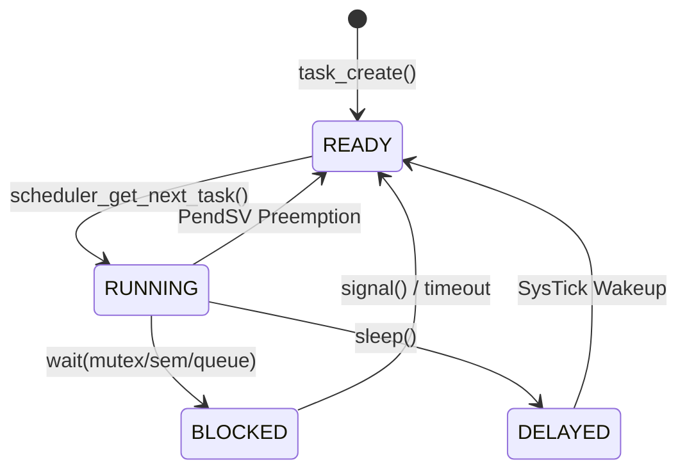

# Morph-RT: Hard Real-Time Operating System Kernel

A hard real-time operating system (RTOS) kernel engineered from scratch for the ARM Cortex-M4 architecture. Written in C11 and Thumb-2 assembly, the system provides deterministic preemption, zero-allocation memory management, and bounded-time IPC primitives.

<div align="center">
  
</div>

## Architecture & Technical Implementation

Morph-RT is designed around a strictly deterministic execution model. Every architectural decision prioritizes bounded worst-case execution time (WCET) over throughput, ensuring absolute predictability for hard real-time constraints.

### Deterministic O(1) Memory Pools

To prevent memory fragmentation and eliminate non-deterministic heap allocation latency, the kernel employs a strictly static, pool-based memory allocator. All kernel objects (TCBs, stacks, IPC primitives) are statically allocated via memory pools during initialization.

Allocations utilize hardware-friendly bitwise logic. Free blocks are tracked via a 32-bit `free_bitmap`. By checking bits, the allocator finds the next free block in strict O(1) time without traversing linked lists.

```text
Memory Pool Layout (e.g., TCB Pool)
+----------------+  <-- pool_start
| TCB Block 0    |  (Allocated: Bit 0 = 0)
+----------------+
| TCB Block 1    |  (Free: Bit 1 = 1)
+----------------+
| ...            |
+----------------+
| TCB Block 31   |
+----------------+  <-- pool_start + (object_size * 32)
```

### Intrusive Linked Lists & State Management

Task states are managed using intrusive linked lists (`list_head_t`). Instead of dynamically allocating queue nodes, each TCB contains embedded links (`ready_link`, `wait_link`, `delay_link`). This guarantees that a task can always be queued without the risk of an out-of-memory failure.



### O(1) Timing Wheel for Lower Scheduling Jitter

To prevent unbounded scheduling jitter caused by iterating through sorted sleeping tasks during a `SysTick` interrupt, the kernel implements an O(1) timing wheel. Instead of an O(N) linked list insertion, delayed tasks are hashed into a bucketed array.

The slot index is computed using a fast bitwise `AND` on the current tick and the wheel mask. Tasks with delays exceeding the wheel size track remaining full rotations via a `rotations` counter in the TCB.

```c
// O(1) insertion into the timing wheel
uint32_t ticks = ticks_until(wake_tick, tick_now);
t->rotations = ticks / TIMING_WHEEL_SIZE;
uint32_t slot = (tick_now + ticks) & TIMING_WHEEL_MASK;
list_insert_tail(&timing_wheel[slot], &t->delay_link);
```
During the `SysTick` handler, the kernel only iterates over the tasks in the current slot, decrementing rotations or waking the task if `rotations == 0`.

### Context Switching & PendSV Preemption

Context switching leverages the ARM Cortex-M `PendSV` (Pendable Service Call) exception, ensuring context switches only occur when no other high-priority interrupts are active. The hardware automatically stacks caller-saved registers (`R0-R3`, `R12`, `LR`, `PC`, `xPSR`), minimizing the assembly footprint required to stack callee-saved registers (`R4-R11`).

```assembly
    /* PendSV_Handler Snippet */
    mrs     r0, psp             /* Get current Process Stack Pointer */
    stmdb   r0!, {r4-r11, lr}   /* Push R4-R11 and EXC_RETURN */
    str     r0, [r1]            /* current_task->stack_pointer = r0 */
```

*The stack pointer is directly saved to the active Task Control Block (TCB).*

### Power-of-2 Circular Buffers

IPC primitives like message queues rely on generic void-pointer circular buffers. By enforcing capacity constraints to powers of 2, the kernel replaces expensive modulo (`%`) division with bitwise `AND` masking. In a tight real-time loop, avoiding the hardware divider reduces clock cycle variance.

```c
// Bounded O(1) buffer push with bit masking
self->tail = (self->tail + 1) & self->mask;
```

### Foreign Function Interface (FFI) with Embedded Rust

Morph-RT demonstrates interoperability between the C kernel and application logic written in Rust. By compiling a `#![no_std]` Rust crate to a static library (`thumbv7em-none-eabihf`), the CMake build system links it directly against the RTOS.

Rust functions are exposed to the C kernel using `extern "C"`, allowing them to be spawned directly as standard RTOS tasks. Furthermore, the Rust application can safely invoke the kernel's C APIs—such as `task_delay` or `queue_receive`—by binding to them via FFI, providing a modern, memory-safe layer on top of the real-time primitives.

## Features

* **Preemptive Priority Scheduling:** Priority-based preemption with round-robin execution for tasks at identical priority levels.
* **Static Memory Allocation:** O(1) deterministic allocation using bitmap-tracked memory pools.
* **Intrusive Data Structures:** Zero-allocation queueing using embedded linked-list nodes.
* **IPC Primitives:** Mutexes (with priority inheritance), counting semaphores, and generic message queues.
* **Zero-Overhead Wraparounds:** Power-of-2 circular buffers for bounded queue operations.
* **Hardware Trace Integration:** Native integration with SEGGER SystemView via RTT for sub-microsecond visualization of scheduler behavior.
* **Foreign Function Interface:** Demonstrates robust FFI by linking an embedded Rust static library (`thumbv7em-none-eabihf`) for application layer logic.

## Build Instructions

### Prerequisites

* `cmake` (>= 3.16)
* `arm-none-eabi-gcc` toolchain
* Rust toolchain (with `thumbv7em-none-eabihf` target) for FFI examples
* `make`

### Compilation

```bash
# Clone the repository
git clone https://github.com/username/morph-rt.git
cd morph-rt

# Create build directory
mkdir build && cd build

# Configure for STM32F4 hardware target
cmake -DCMAKE_SYSTEM_NAME=Generic -DCMAKE_C_COMPILER=arm-none-eabi-gcc ..

# Build kernel and examples
make -j$(nproc)
```

### Execution & Flashing

Binaries are generated as both `.elf` and `.bin` files in the `build/` directory.

To flash to an STM32F4 Discovery board using `st-flash`:

```bash
st-flash write traffic_stop_ffi.bin 0x08000000
```

To debug via GDB/OpenOCD:

```bash
openocd -f board/stm32f4discovery.cfg
arm-none-eabi-gdb -ex "target extended-remote localhost:3333" -ex "load" traffic_stop_ffi
```
